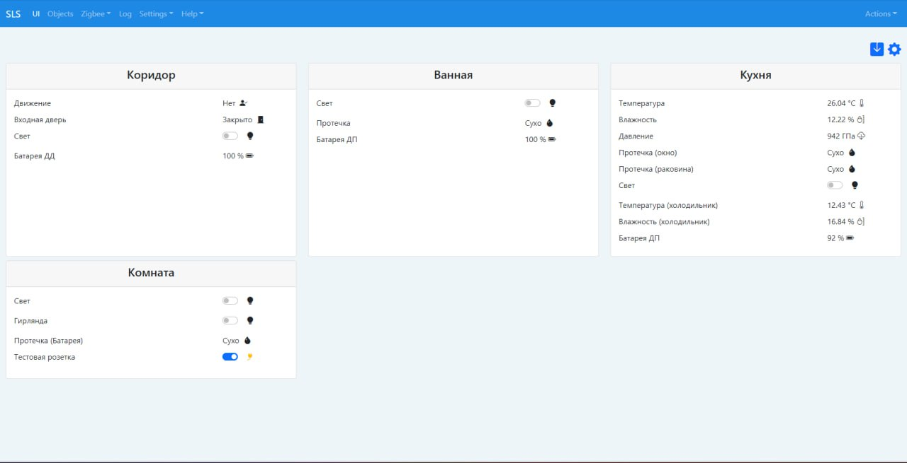

<h1>Web-интерфейс для SLS Gateway</h1>

Интерфейс написан с помощью VueJS 3 и Bootstrap 5.

Иконки для интерфейса берутся из https://icons.getbootstrap.com/.

На странице отображаются статусы устройств, которые можно сгруппировать по карточкам (например по комнатам, группам розеток, выключателей или датчиков).

Статусы сенсоров и переключателей обновляются из Websocket.

Для настройки отображаемых статусов устройст нужно перейти в настройки, кликнув на кнопку .

Комнаты или группы добавляются вписывая название, далее можно будет выбрать из выпадающего списка.

Устройства добаляются из списка заджойненых устройств.

После выбора устройства можно будет выбрать свойства, доступные для данного девайса.

Также устанавливается текстовое описание устройства.

Тип свойства выбирается из выпадающего списка:

1. switch - переключатель, применяется для розеток и выключателей.

2. sensor - отображение информации свойства устройства, можно добавить единицы измерения.

3. bin-sensor - свойство датчика, отображающее true или false. Состояние true соответствует тревоге. Нужно задать текстовое описание активированного и деактивированного состояния для отображения на web-интерфейсе.

4. bin-sensor-door - свойство датчика, отображающее true или false. Состояние false соответствует тревоге. Нужно задать текстовое описание активированного и деактивированного состояния для отображения на web-интерфейсе. Иконки открытой и закрытой двери уже добавлены.
После добавления устройств нужно сохранить настройки, кликнув на иконку 

TO DO
- [X] Адаптивный интерфейс конфиг-раздела.
- [X] Не добавляет устройство в пустой список.
- [ ] Добавление темной темы.
- [ ] Добавление типа устройства Диммер.
- [ ] Добавление типа устройства для выбора цветовой температуры освещения.
