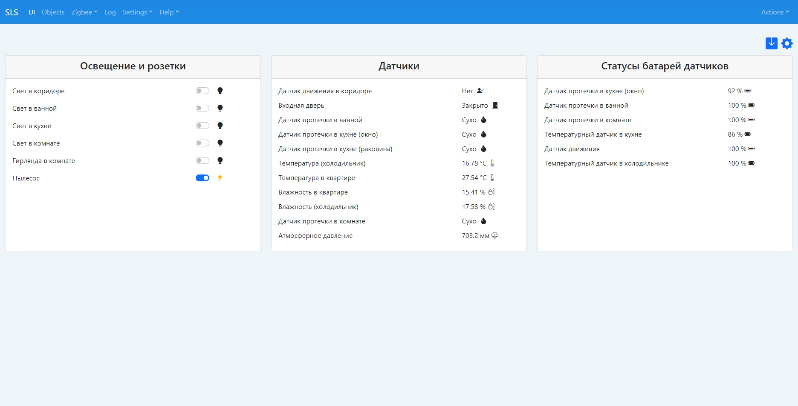
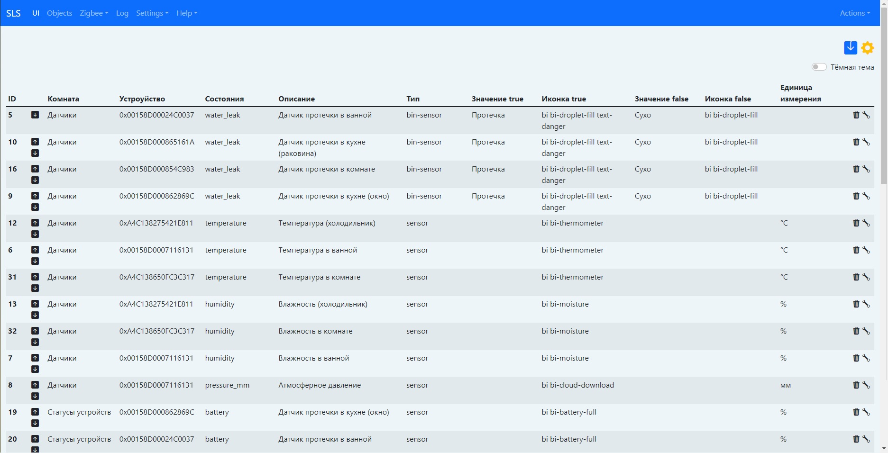

<h1>Web-интерфейс для SLS Gateway</h1>

Интерфейс написан с помощью VueJS 3 и Bootstrap 5.

Иконки для интерфейса из папки CDN берутся из https://icons.getbootstrap.com/.

Иконки для интерфейса из папки NO CDN - это спецсимволы html (таблицы с кодами ищутся в интернете). Можете добавалять свои иконки в datalist id="icons"

На странице отображаются статусы устройств, которые можно сгруппировать по карточкам (например по комнатам, группам розеток, выключателей или датчиков).

Статусы сенсоров и переключателей обновляются из Websocket.

Для настройки отображаемых статусов устройст нужно перейти в настройки, кликнув на кнопку  или &#128736;.

Комнаты или группы добавляются вписывая название, далее можно будет выбрать из выпадающего списка.

Устройства добаляются из списка заджойненых устройств.

После выбора устройства можно будет выбрать свойства, доступные для данного девайса.

Также устанавливается текстовое описание устройства.

Тип свойства выбирается из выпадающего списка:

1. switch - переключатель, применяется для розеток и выключателей. Можно задать разные иконки для включенного и выключенного состояния

2. sensor - отображение информации свойства устройства, можно добавить единицы измерения и иконку (отображается Иконка true).

3. bin-sensor - свойство датчика, отображающее true или false. Нужно задать текстовое описание и иконки активированного и деактивированного состояния для отображения на web-интерфейсе .

4. dimmer - выбор переменной из диапазона значений в виде ползунка. Применяется для диммеров и выбора цветовой температуры. В поле "Значение true" задается верхний предел значений, в поле "Значение false" - нижний.

5. unixtime - отображение даты и времени unix timestamp в удобном для человека виде. 

После добавления устройств нужно сохранить настройки, кликнув на иконку  или &#128428;.

TO DO
- [X] Адаптивный интерфейс конфиг-раздела.
- [X] Не добавляет устройство в пустой список.
- [X] Добавление темной темы.
- [X] Добавление типа устройства Диммер.
- [ ] Добавление типа устройства для выбора RGB.
- [ ] Добавление графиков для sensor.
- [X] Перенос css и js на локальные ресурсы.

